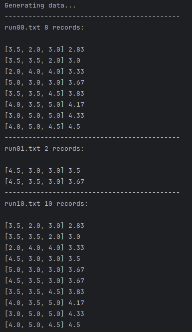

## External File Sorting
This project implements an external sorting algorithm using large buffers to efficiently handle datasets that exceed available RAM. 
It simulates real-world scenarios where data must be sorted while optimizing disk I/O operations. 
The program generates records, sorts them in phases using buffer-based merging, and analyzes performance metrics, comparing theoretical and practical results.

The experiment was conducted to examine how changes in specific parameters
affect the number of I/O operations, and to compare the theoretical I/O 
operation counts with the practical ones.
I performed tests with significantly varying record counts,
and analyzed the differences between the theoretical and practical I/O
operations using detailed charts.


More about the experiment and its results [here](report.pdf).

## Table of Contents

- [Example usage](#example-usage)
- [Arguments](#arguments)
  - [Data Source Argument](#1-data-source-argument)
  - [Presentation Mode Argument](#2-presentation-mode-argument)
- [Records](#records)

## Example usage

<div align="center">
  
  <br>
  <em>Example usage (with arguments "generate" and "short")</em>
</div>

## Arguments

The program's behavior can be customized using two separate arguments:

### 1. Data Source Argument
Specifies how the input data is provided.
- **Options:**
    - `"generate"`: The program generates records based on their predefined count.
    - `"file"`: Data is read from a file.
    - `"keyboard"`: Data is entered manually via the keyboard.


- **Default Behavior:**  
  If no argument is provided, the program will generate records automatically.  
  The data is stored in the file `data.txt` by default.

### 2. Presentation Mode Argument
 Defines how the runs are presented after each phase of the algorithm.
- **Options:**
    - `"short"`: Displays the runs in a shortened version.
    - `"full"`: Presents the runs in full detail.


- **Default Behavior:**  
  If no argument is provided, the runs are not displayed.


## Records

Each record is provided in a text file, with each record in a separate line. Record is formatted as follows:

- The record contains 3 numbers selected from the set `[2, 3, 3.5, 4, 4.5, 5]`, each separated by a space.
- The ordering of the records is based on the average score computed from these 3 values.

**Example record:**
```md
2 3.5 4
```
